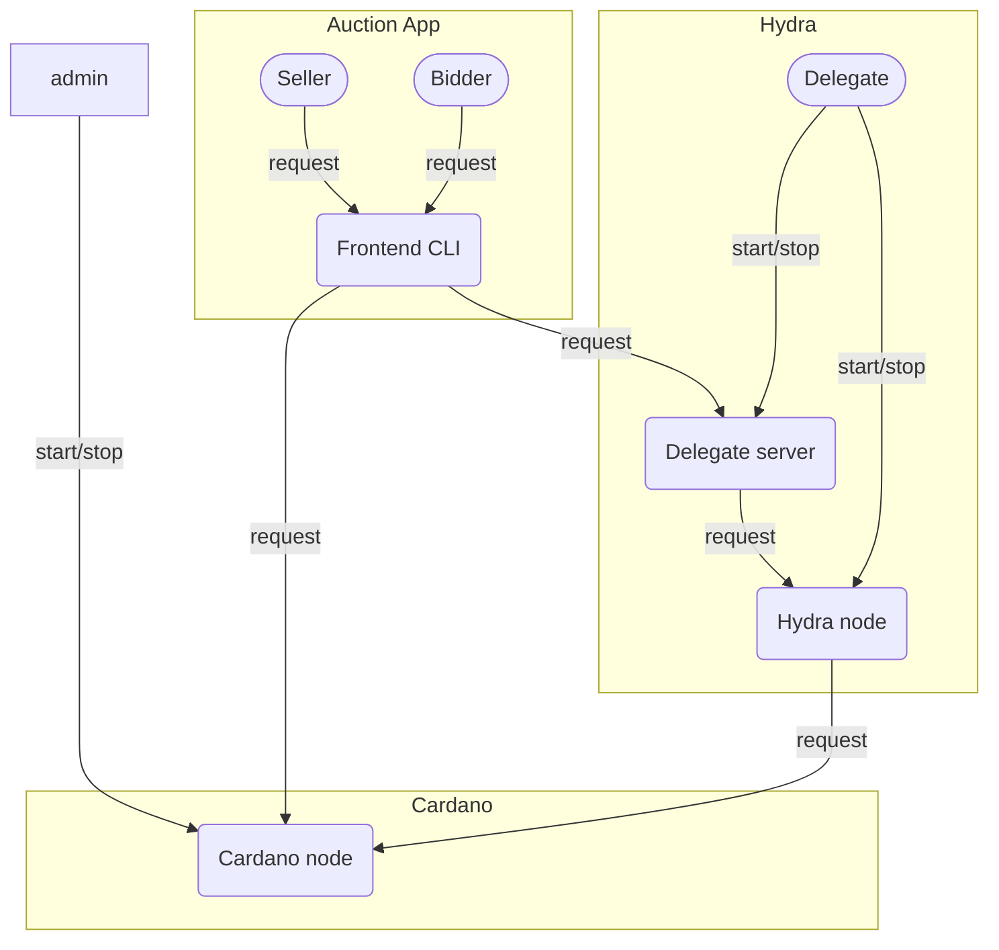

# Off-chain architecture and specification

In the Hydra Auction architecture,
commands/requests flow from people (Seller, Bidder, Delegate)
to systems (Frontend/CLI, Cardano node, Delegate server, Hydra node) as follows:

In the rest of this document,
we will describe each of these systems
and the request types that people can submit to those systems.

## Off-chain workflow

A typical workflow for an auction should look as follows:

1. The delegates ensure that all daemon services are started
   (Delegate servers, Hydra nodes).
2. Delegates initialize the Hydra Head.
3. The seller announces the auction.
4. **(Bidding start time is reached)**
5. The seller starts the bidding phase.
6. A delegate moves the standing bid to L2.
7. The delegates open the Hydra Head.
8. Bidders may submit new bids on L2.
9. One of the delegates or bidders closes the Hydra Head on L1.
The delegates' Hydra nodes continuously monitor L1 for this closing transaction,
ready to submit contesting transactions if necessary.
10. The seller or one of the bidders or delegates
fans out the standing bid to L1.
11. **(Bidding end time is reached)**
12. The winning bidder may buy the auction lot.
13. **(Voucher expiry time is reached)**
14. If the auction lot has not been bought by the winning bidder,
then the seller reclaims the auction lot
and may claim the winning bidder’s bidder deposit.
15. One of the delegates distributes the auction fees to the delegates.
16. **(Cleanup time is reached)**
17. The seller spends the standing bid utxo and burns the voucher token.

## Services

### Cardano node

The Cardano node is responsible for
broadcasting transactions to the Cardano network.

In the real world, this would correspond to the node,
provided by a light-wallet backend.
Alternatively, for full decentralization, a user could in principle
choose to run their own Cardano node, without a trusted intermediary.

For testing purposes local cardano-node could be used, which is started
using `docker-compose`.

**start.** Start a Cardano node, as a single-node development network (devnet)
or as a node on a known Cardano network (mainnet or testnet).

Command parameters:

- Cardano node config (state directory, tracer, etc.)
- Cardano network type = Devnet | Known network

**stop.** Stop the Cardano node.

### Hydra node

The Hydra node is responsible for broadcasting L2 transactions to the Hydra Head
and participating in the Hydra Head consensus protocol
(including L1 Hydra Head transactions).

Hydra node API should be only accessible by Delegate server.
API reference: https://hydra.family/head-protocol/api-reference

Delegate server may use this commands: `Init`, `Commit`, `NewTx`, `GetUTxO`, `Close`, `Fanout`.

### Delegate server

The delegate server is responsible for
responding to requests from the Frontend CLI,
constructing queries or transactions as necessary
to submit to the delegate’s Hydra node.

Each delegate should have its own delegate server and Hydra node running.

**start.** Start a delegate server and an associated Hydra Node.

Command parameters:

- Delegate server ID
- Delegate server config
- …

**stop.** Stop the delegate server and its associated Hydra node.

### Frontend CLI

The frontend CLI is a program that can be run by each of the seller and bidders.
It provides an interactive prompt
for them to submit their actions to interact with the auction.

**start.** Start a frontend CLI session.

Command parameters:

- User for transactions
  (taken from predefined list of actors,
   with fixed keys laying in `data/credentials`)

**stop.** Quit the frontend CLI session.

## APIs

### Frontend CLI

**prepare.** Distribute ADA from the faucet
to all the potential users in the auction (Alice, Bob, etc.)
and provide a freshly minted NFT to the recipient,
so that the NFT can be put up for auction.

This action only makes sense when auction is running on devnet.

Request parameters:

- NFT recipient

**showUtxos.** Show the utxos owned by the current user.

**showAllUtxos.** Show the utxos of all users (Alice, Bob, etc.).

Request parameters: none.

**announceAuction.** Construct `AuctionTerms`
using the request parameters provided
(seller implicitly set to the request submitter),
and submit an L1 transaction to the Cardano node.

Request parameters:

- Auction ID
- Auction config
- Auction lot asset class
- Hydra Head ID
- Delegates

The `AuctionTerms` for the Auction ID are cached in the auction state directory.

**startBiddingL2.** Execute a sequence of actions to allow bidding to start on L2.

Request parameters:

- Auction ID
- Delegate Server ID

This endpoint is equivalent to
calling startBiddingL1 and then calling moveStandingBidToL2.

**startBiddingL1.** If the request submitter is the seller
corresponding to the `AuctionTerms` of the Auction ID,
then submit an L1 transaction to the Cardano node
to start the bidding for the auction.

Request parameters:

- Auction ID

**moveStandingBidToL2.** Commit the standing bid to the Hydra Head
and coordinate the opening of the Hydra Head.

Request parameters:

- Auction ID
- Delegate server ID

This endpoint performs the following actions:

- Send a request to the chosen delegate server
to commit the standing bid utxo to the Hydra Head.
- When confirmation is received for the commit transaction,
send a request to all other Hydra delegates to commit nothing to the Hydra Head.
- Send a request to the chosen delegate server to open the Hydra Head.

**newBidL1.** Submit a new bid as an L1 transaction to the Cardano node.

Request parameters:

- …

**newBidL2.** Send a request to a given delegate server (chosen by the bidder)
to submit a new bid as an L2 transaction to the Hydra Head.

Request parameters:

- Bid amount
- Delegate server ID

Response:

- The bidder receives a Hydra Head L1 closing transaction
(with the latest L2 snapshot) signed by the delegate
to whom the newBidL2 request was forwarded,
which he can submit start from (biddingEnd - contestationPeriodDuration).

Cache this post-dated transaction for the bidder.

**closeHeadByBidder.** Submit the cached post-dated L1 closing transaction
to the Cardano node.

Request parameters:

- …

**fanout.** Fan out the standing bid utxo from the Hydra Head,
so that it can be used in L1 transactions.

Request parameters:

- …

### Delegate server

…
