# On-chain scripts

We use one minting policy for the voucher token and four validator scripts for
the auction escrow, standing bid, bidder deposit, and fee escrow.
They are all statically parametrized on the auction terms
and depend on each other as follows:

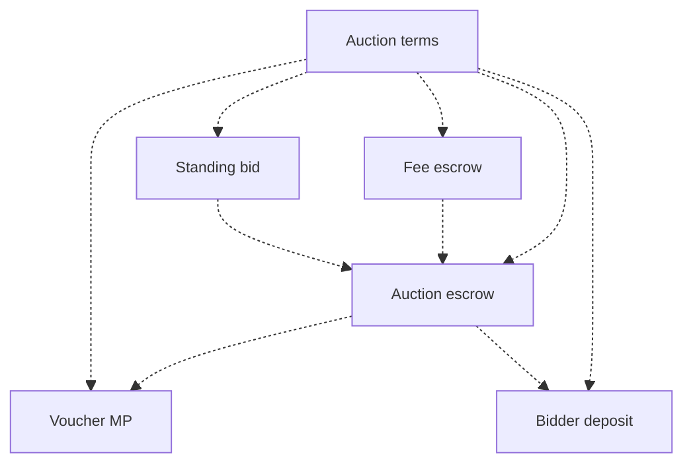

The validator scripts do not need to depend
on the voucher minting policy at compile time,
because their datums mention the voucher’s currency symbol.

## Parameters and state

An auction is uniquely parametrized by its **auction terms**,
which are fixed when it is announced.

```haskell
data AuctionTerms = AuctionTerms
  { auctionLot :: AssetClass
  -- ^ What is being sold at the auction?
  , sellerPKH :: PubKeyHash
  -- ^ Renamed from seller to sellerPKH
  , sellerVK :: BuiltinByteString
  -- ^ New field. Seller verification key
  , hydraHeadId :: CurrencySymbol
  -- ^ Which Hydra Head is authorized to host the bidding for this auction?
  , delegates :: [PubKeyHash]
  -- ^ Who is running the authorized Hydra Head?
  , biddingStart :: POSIXTime
  -- ^ When can bidding start?
  , biddingEnd :: POSIXTime
  -- ^ When must bidding end?
  , voucherExpiry :: POSIXTime
  -- ^ After which time can the winning bidder
  -- no longer be able to buy the auction lot?
  , cleanup :: POSIXTime
  -- ^ After which time can the remaining auction utxos be cleaned up?
  , auctionFeePerDelegate :: Natural
  -- ^ Each delegate will receive this fee portion from the proceeds of
  -- the auction, when the auction lot is purchased or reclaimed.
  , startingBid :: Natural
  -- ^ The auction lot cannot be sold for less than this bid price.
  , minimumBidIncrement :: Natural
  -- ^ A new bid can only supersede the standing bid if it is larger
  -- by this increment.
  , utxoNonce :: UtxoRef
  -- ^ The seller consumed this utxo input in the auction announcement
  -- transaction that provided the auction lot to the auction.
  , minDepositAmount :: Natural
  -- ^ Minimal amount of ADA that a bidder must deposit in a
  -- bid deposit utxo for the auction. This is only checked off-chain.
  }
```

Each of the auction lifecycle times is defined as L1 POSIX times.
The bidding end transition requires special care:
the auction interactions must migrate from L2 to L1 at this time,
but L2 does not track time.
See [ADR 2: Handling time on L2](adr/2022-12-26_002-handling_time_on_L2.md) for more details.

The `utxoNonce` in the auction terms ensures
that the voucher’s currency symbol is unique
because the voucher minting policy
is statically parametrized by the auction terms.
Similarly, all the validator scripts in the auction are made unique
via static parametrization on the auction terms.

The seller will act as some sort of "oracle",
by providing a signature that guarantees the link
between the bidder verification key, and its pubkey hash.
This piece of data, that is signed by the seller,
is not stored on-chain though, but needs
to be communicated between seller and bidder through
off-chain means.

The idea is to verify on-chain
that the bidder has signed their new bid,
and is meant to prevent cases where
a delegate could submit a false bid for an unaware bidder.

To verify something on-chain,
we need access to the verification key that produced the signature.
We already have the bidder `PubKeyHash` available in the `BidTerm`,
but that can not be used to verify a signature produced by the bidders signing key.
Unfortunately, it is not possible to even derive the `PubKeyHash` from the verification key on-chain,
so we will have to carry around both in the datum.


At bidding start time, the seller initializes the standing bid state with
an empty standing bid.
The standing bid can be modified
as new bids are submitted to the auction until the bidding end time.

```haskell
data StandingBidState = StandingBidState
  { standingBid :: Maybe BidTerms }

data BidTerms = BidTerms
  { bidderPKH :: PubKeyHash
  -- ^ PubKeyHash of whoever submitted the bid
  , bidderVK :: BuiltinByteString
  -- ^ New field. Verification Key of whoever submitted the bid
  , bidPrice :: Natural
  -- ^ Which price did the bidder set to buy the auction lot?
  , bidderSignature :: BuiltinByteString
  -- ^ New field. Represents the signed payload by the bidder
  , sellerSignature :: BuiltinByteString
  -- ^ Represents the signed payload by the seller
  }
```

If the auction is moved to the Hydra Head defined in the auction terms,
then the standing bid state must be available on that L2 ledger,
to allow the standing bid to be replaced
by new bids submitted to the Hydra Head.

On L1, the state of the auction is tracked in two phases:

```haskell
data AuctionState =
    Announced
  | BiddingStarted
```


## Script datums

The auction terms track the immutable information known at auction announcement,
while the script datums track information that is either
unknown at that time or can change afterwards.
The script datums also track the voucher's currency symbol
because parametrizing the validator scripts on it
would result in a circular dependency.

```haskell
data AuctionEscrowDatum = AuctionEscrowDatum
  { auctionState :: AuctionState
  , voucherCS :: CurrencySymbol
  }

data StandingBidDatum = StandingBidDatum
  { standingBid :: StandingBidState
  , voucherCS :: CurrencySymbol
  }

data BidDepositDatum = BidDepositDatum
  { bidder :: PubKeyHash
  -- ^ Which bidder made this deposit?
  , voucherCS :: CurrencySymbol
  }

type AuctionFeeEscrowDatum = ()
```

## Voucher minting policy

The voucher token is an NFT
that acts as the state token for the standing bid of the auction.
The true standing bid utxo for the auction at any given time
is the one that contains the voucher,
which proves its provenance from the auction announcement transaction
that sets the auction terms.
Any standing bid utxo that does not contain the voucher token
must be rejected as a false standing bid.

The voucher minting policy is responsible for
the proper execution of the auction announcement transaction.
The voucher is minted when the auction is announced,
and it is burned after the cleanup time for the auction.

The **auction announcement** is the transaction
that mints the voucher for a given auction.
It is the starting point in the lifecycle of every auction.

Under the **mint voucher** redeemer, we enforce that:

- There is one input spent by the seller that contains the auction lot.
This input's `UtxoRef` is the same as
the `utxoNonce` defined in the auction terms.
- This is one voucher NFT minted,
with this minting policy’s own currency symbol.
- There is one output sent to the auction escrow validator,
containing the minted tokens and the auction lot.
The auction escrow datum is initialized using `initAuctionEscrowDatum`
with the auction’s voucher currency symbol.
- The conditions in `validAuctionTerms` are satisfied
when applied to the auction terms.
  - The auction terms will not need to be revalidated after this,
    because subsequently all transactions for the auction will use
    on-chain script logic that is statically parametrized on these
    immutable auction terms.
- The transaction validity interval ends before the bidding start time.

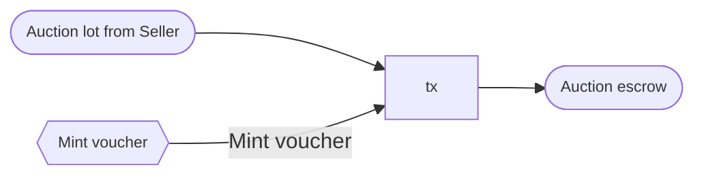

The initial datum for the auction escrow must be set as follows:

```haskell
initAuctionEscrowDatum :: CurrencySymbol -> AuctionEscrowDatum
initAuctionEscrowDatum voucherCS = AuctionEscrowDatum
  { auctionState = Announced
  , voucherCS = voucherCS
  }
```

The auction terms must satisfy the following conditions:

```haskell
validAuctionTerms :: AuctionTerms -> Bool
validAuctionTerms AuctionTerms{..} =
  biddingStart < biddingEnd &&
  -- bidding ends after it starts
  biddingEnd < voucherExpiry &&
  -- voucher expires after bidding ends, so that the winning bidder
  -- can buy the auction lot.
  voucherExpiry < cleanup &&
  -- cleanup happens after voucher expiry, so that the seller can claim
  -- the winning bidder's deposit if the auction lot is not sold
  minimumBidIncrement > 0 &&
  -- new bids must be larger than the standing bid
  auctionFeePerDelegate > 2_000_000 &&
  -- the auction fee for each delegate must contain the min 2 ADA for the utxos
  -- that will be sent to the delegates during fee distribution.
  startingBid > auctionFeePerDelegate * length delegates &&
  -- the auction fees for all delegates must be covered by the starting bid
  length delegates > 0 &&
  -- there must be at least one delegate
```

The seller must ensure that the `delegates` defined in the auction terms
are the same as the Hydra Head participants in the `hydraHeadId` Hydra Head.
Otherwise, the Hydra Head participants may refuse to host the auction bidding
because the auction fees would not go to the Hydra Head participants.
Unfortunately, this correspondence between delegates and Hydra Head participants
cannot be verified by on-chain logic in the auction announcement transaction.

Under the **burn voucher** redeemer, we enforce that:

- The transaction validity range starts after the cleanup time.

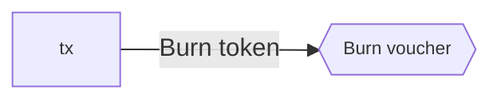

## Auction escrow validator

This validator holds the auction lot after the auction announcement,
until either the winning bidder buys it or the seller reclaims it.

Under the **start bidding** redeemer, we enforce that:

- There is one input spent from the auction escrow validator,
containing the auction lot and voucher tokens defined in the auction terms.
The auction state is `Announced` in its datum.
- There is one output sent to the auction escrow validator,
containing the auction lot.
- There is one output sent to the standing bid validator,
containing the voucher.
The standing bid datum is initialized using `initStandingBidDatum` with
the auction’s voucher currency symbol.
- The transaction validity interval starts after the bidding start time
and ends before the bidding end time.
- The transaction is signed by the seller.
- No tokens are minted or burned.

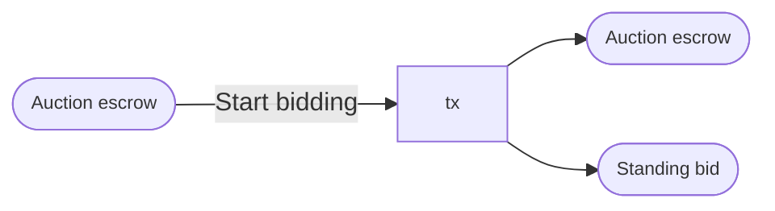

The auction escrow datum must be set as follows
under the `start bidding` redeemer:

```haskell
startBiddingAuctionEscrowDatum
  :: AuctionEscrowDatum
  -> AuctionEscrowDatum
startBiddingAuctionEscrowDatum auctionEscrowDatum =
  auctionEscrowDatum{auctionState = BiddingStarted}
```

The initial datum for the standing bid utxo must be set as follows:

```haskell
initStandingBidDatum :: CurrencySymbol -> StandingBidDatum
initStandingBidDatum voucherCS = StandingBidDatum
  { standingBid = StandingBidState
      { standingBid = Nothing}
  , voucherCS = voucherCS
  }
```


Under the **seller reclaims** redeemer, we enforce that:

- There is one input spent from the auction escrow validator.
- There is one output sent to the seller,
containing the auction lot.
- There is one output sent to the fee escrow validator,
containing the total auction fees that will be distributed to the delegates.
- The transaction validity interval starts after the voucher expiry time.
- No tokens are minted or burned.

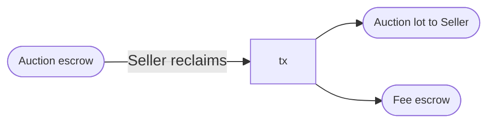

Under the **bidder buys** redeemer, we enforce that:

- There is one input spent from the auction escrow validator,
containing the auction lot mentioned in the auction terms.
Its datum defines the auction state and voucher currency symbol.
- There is one reference input from the standing bid validator,
containing the voucher mentioned in the auction escrow datum
and defining the standing bid state.
- There is one output sent to a buyer, containing the auction lot.
- There is one output sent to the seller,
containing the standing bid amount minus the total auction fees,
plus the ADA amount contained in the auction escrow and standing bid utxos.
- There is one output sent to the fee escrow validator,
containing the total auction fees that will be distributed to the delegate.
- The conditions in `validBuyer` are satisfied when applied to
the auction terms, auction state, standing bid state, and buyer.
- The transaction validity interval starts after the bidding end time
and ends before the voucher expiry time.
- No tokens are minted or burned.

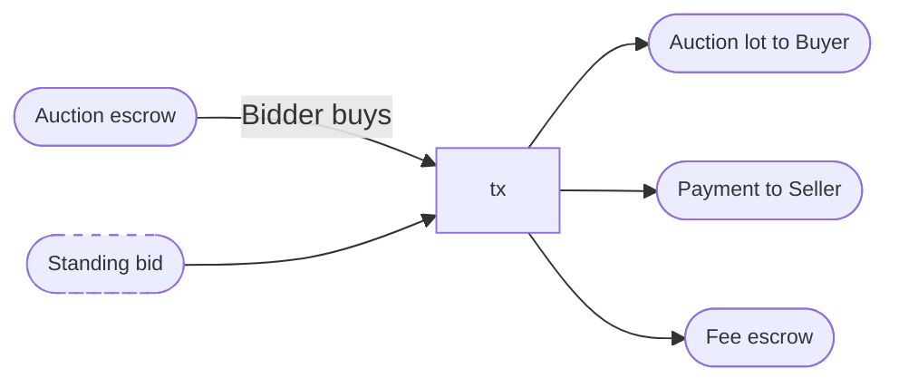

The standing bid datum is valid for the bidder to buy the auction lot
if the following conditions are met under the auction terms:

```haskell
validBuyer
  :: AuctionTerms
  -> AuctionState
  -> StandingBidState
  -> PubKeyHash
  -> Bool
validBuyer AuctionTerms{..} aState StandingBidState{..} buyer
  | Just BidTerms{..} <- standingBid =
  buyer == bidder
  -- ^ The buyer is the bidder who submitted the standing bid
validStandingBidState _ _ _ _ = False
```

## Standing bid validator

The standing bid validator is primarily responsible for
the transitions in the standing bid state
that are allowed between the bidding start and end times.
It is also responsible for ensuring that the standing bid state exists
as long as it is needed by the other scripts
to determine who can claim the auction lot and bidder deposits.

Under the **move to hydra** redeemer, we enforce that:

- There is one input from the standing bid validator.
- There is one input from the Hydra Head initial validator
($\nu_\textrm{initial}$),
containing one Hydra Head participation token
of the same currency symbol as the `hydraHeadId` in the auction terms.
The redeemer provided to this input
mentions the standing bid input by `UtxoRef`.
- There is one output sent to the Hydra Head commit validator
($\nu_\textrm{commit}$),
containing the Hydra Head participation token.
- No tokens are minted or burned.

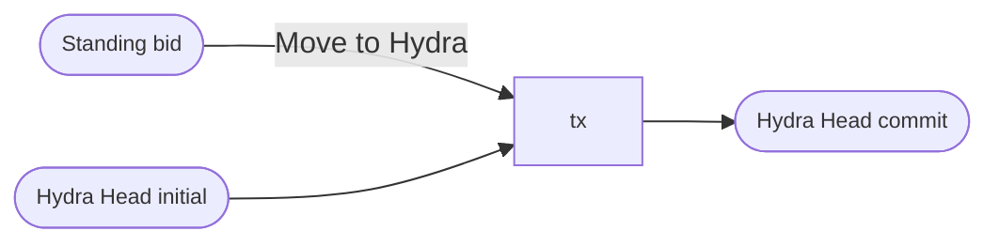

Under the **new bid** redeemer, we enforce that:

- There is one input from the standing bid validator,
defining the old standing bid state.
- There is one output sent to the standing bid validator,
defining the new standing bid state.
- The conditions in `validNewBid` are satisfied when applied to the auction terms,
old standing bid state,
and new standing bid state.
- The transaction validity range must end at the bidding end time.
- No tokens are minted or burned.

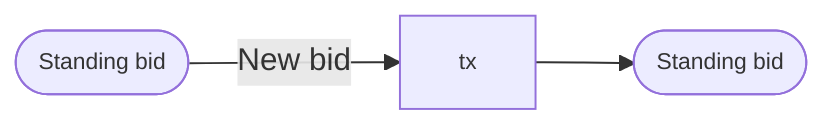

A new bid is allowed to change the standing bid state as follows:

```haskell
validNewBid
  :: AuctionTerms
  -> CurrencySymbol
  -> StandingBidState
  -> StandingBidState
  -> Bool
validNewBid AuctionTerms{..} voucherCS oldStandingBidState newStandingBidState =
  isJust $ do
    let StandingBidState oldBid = oldStandingBidState
    let StandingBidState newBid = newStandingBidState
    BidTerms bidderPKH bidderVK newPrice bidderSignature sellerSignature <- newBid
    -- The seller has allowed the bidder to participate in the auction
    guard $ verifyEd25519Signature (sellerVK terms) (sellerSignatureMessage voucherCS bidderPKH bidderVK) sellerSignature
    -- The bidder has correctly signed the datum
    guard $ verifyEd25519Signature bidderVK (bidderSignatureMessage voucherCS newPrice bidderPKH) bidderSignature
    -- The new bid respects the starting price and minimum bid increment
    -- conditions in the auction terms.
    guard $ case oldBid of
      Nothing ->
        startingPrice <= newPrice
      Just (BidTerms _ oldPrice) ->
        oldPrice + minimumBidIncrement <= newPrice
```

Under the **cleanup** redeemer, we enforce that:

- There is one input from the standing bid validator.
- The voucher in the input is burned.
  - Note: the minting policy enforces
  that this will only happen after cleanup time for the auction,
  and this token burn can only happen on L1.
- There is one output that pays
the remaining ADA from the standing bid utxo to the seller.

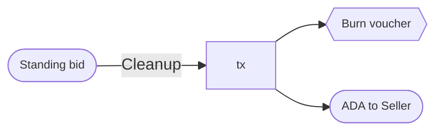

## Bid deposit validator

The bid deposit is responsible for ensuring
that bidders can recover their bid deposits,
except for the case when the seller claims the winning bidder’s security deposit
after the voucher expiry time.

If a bidder wishes to be considered by the seller for
participation in the auction as an approved bidder,
the bidder can send a utxo to the bid deposit validator,
mentioning the auction’s voucher currency symbol
and the bidder’s pub-key hash in the datum.

The seller has full discretion on whether
to include any bidder in the auction,
but the seller should consider including bidders
that have provided bid deposits with enough ADA to satisfy the seller.
To allow a bidder to participate in an auction
we will require the seller to generate a signature
for each bidder they want to allow in.

This signature can be generated by signing
a pair consisting of the `voucherCS` and `bidderPKH`

```haskell
import Crypto.Sign.Ed25519

generateSellerSignature :: SigningKey PaymentKey -> CurrencySymbol -> PubKeyHash -> BuiltinByteString
generateSellerSignature skey = toBuiltin . (dsign skey) . sellerSignatureMessage

sellerSignatureMessage :: CurrencySymbol -> PubKeyHash -> BuiltinByteString
sellerSignatureMessage voucherCS bidderPKH = toByteString voucherCS <> toBysteString bidderPKH
```

For the sake of fairness, the seller should
inform prospective bidders in the auction announcement
how much ADA they should deposit to qualify for the auction.
However, none of this is enforced by any of the auction’s on-chain validators.

Losing bidders can use the losing bidder redeemer
to collect their deposit
at any time after the bidding end time, or until cleanup is performed on the auction.
The winning bidder can collect their deposit as they are consuming the auction lot utxo.

In both cases, deposits can be collected after the auction cleanup time with the cleanup redeemer.

Under the **losing bidder** redeemer, we enforce that:

- There is one input spent from the bid deposit validator,
defining the bidder and voucher.
- There is one reference input from the standing bid validator,
containing the voucher and defining the standing bid state.
- There is one output sent to the bidder,
containing the bid deposit.
- The standing bid state does not mention the bidder from the bid deposit.
- The transaction validity interval starts after the bidding end time.
- No tokens are minted or burned.

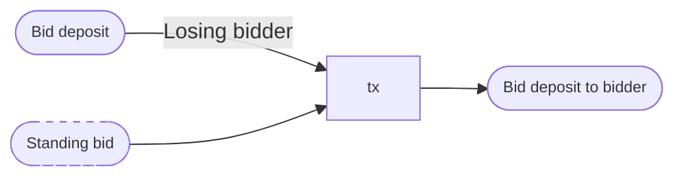

Under the **winning bidder** redeemer, we enforce that:

- There is one input spent from the bid deposit validator,
defining the bidder and voucher.
- There is one input spent from the auction escrow validator,
mentioning the same voucher as the bid deposit in its datum.
- The transaction is signed by the bidder.
- No tokens are minted or burned.

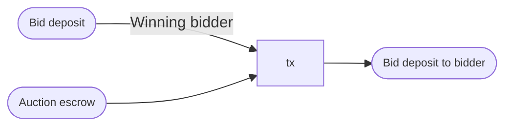

Under the **seller claims deposit** redeemer, we enforce that:

- There is one input spent from the bid deposit validator,
defining the bidder and voucher.
- There is one reference input from the auction escrow validator,
mentioning the same voucher and defining the seller and voucher expiry time.
- There is one reference input from the standing bid validator,
mentioning the same voucher and bidder as the bid deposit input.
- The transaction validity interval starts after the voucher expiry time.
- The transaction is signed by the seller.
- No tokens are minted or burned.

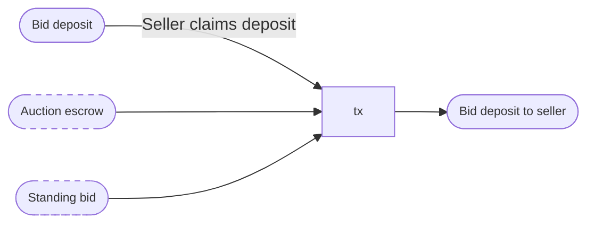

Under the **cleanup** redeemer, we enforce that:

- There is one input spent from the bid deposit validator,
defining the bidder and voucher.
- There is one output sent to the bidder containing the bid deposit.
- The transaction validity time starts after the cleanup time.
- No tokens are minted or burned.

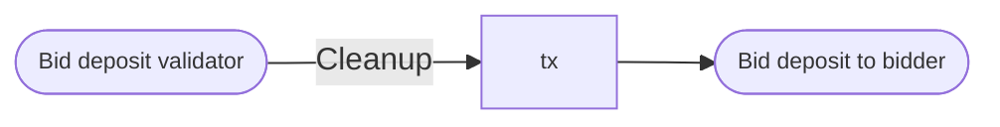

## Fee escrow validator

This validator is responsible distributing the total auction fees
evenly to the delegates, after deducting the transaction fee.

Under the **distribute fees** redeemer, we enforce that:

- There is one input spent from the fee escrow validator,
defining the delegates.
- There is at least one output per delegate such that
the ada contained in that output is >= `auctionFeePerDelegate`
- No tokens are minted or burned.

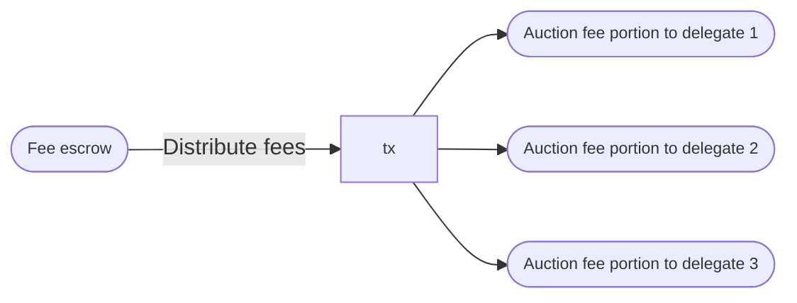

The fee distribution to delegates must satisfy the following conditions:

To keep things simple in this design, we require
the number of delegates in an auction to be small enough
that distributing their respective portions of the auction fee
can be done in a single transaction.
Later on, this can be generalized in a straightforward way
to accommodate incremental fee distribution to a larger number of delegates.
