# M1 Technical specification and architecture

## Background

### Cardano terminology

In this document, we use L1 and L2 as follows:

- **Layer 1 (L1):** the Cardano main network (mainnet) and ledger.
- **Layer 2 (L2):** the network and ledger within a single Hydra Head.

### Auction terminology

**Assets:**

- **Auction lot:** the NFT asset being sold in the auction.
- **Voucher:** the NFT asset that the winning bidder can use
to buy the auction lot for the standing bid’s price.

**Bidding:**

- **Minimum bid increment:** a new bid can replace the standing bid
only if it exceeds it by at least this minimum increment.
- **Starting bid:** the smallest bid that can be accepted by the auction.
- **Standing bid:** the highest of the bids
that have been submitted on or before a given time.

**Deposits:**

- **Bidder deposit:** a fixed deposit that each bidder must provide
(i.e. lock into the auction’s bidder deposit smart contract)
to be eligible to participate in the auction.
A bidder’s deposit can be claimed by the seller
if the bidder wins the auction
but does not buy the auction lot by the voucher expiry time.

**Fees:**

- **Auction fees**: fees paid to the delegates as compensation for
hosting the bidding process of the auction on L2.
These fees must be paid when the winning bidder buys
or the seller reclaims the auction lot,
and they must be distributed equally to the delegates.
If the winning bidder buys the auction lot,
then the auction fees are deducted from his payment to the seller.

**Roles:**

- **Bidders:** a group of people seeking to place bids to buy the auction lot.
- **Delegates:** a group of people trusted to collectively witness new bids
and track the standing bid over time.
- **Seller:** the person seeking to sell the auction lot.
- **Winning bidder:** the bidder whose bid is the standing bid
at the bidding end time for the auction.

### Auction lifecycle

The auction lifecycle is defined by state transitions at the following times,
in chronological order:

- **Auction announcement:** at this time, the seller announces the auction.
The seller does this via an L1 blockchain transaction that locks the auction lot
into the auction escrow validator and specifies the terms of the auction.
Bidders can provide their deposits after the auction is announced.
- **Bidding start time:** after this time,
the seller may declare the list of approved bidders for the auction,
which allows these bidders to startg placing bids in the auction.
Only approved bidders may make bids in the auction.
- **Bidding end time:** after this time,
bidders are no longer allowed to make bids in the auction,
the winning bidder is allowed to buy the auction lot,
and losing bidders can reclaim their deposits after this time.
- **Voucher expiry time:** after this time,
the voucher can no longer be used to buy the auction lot,
and the seller can reclaim the auction lot after this time.
If the winning bidder did not buy the auction lot before this time, then
the seller can also claim the winning bidder's deposit.
- **Cleanup:** after this time,
the seller can no longer claim any bidder deposits,
all bidders can reclaim their deposits unconditionally,
and the the voucher token can be burned.

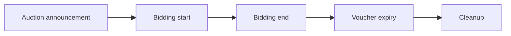

Each of these times is defined (as L1 POSIX times)
by the seller when the auction is announced.
The auction’s state transitions at these times
are managed by on-chain logic evaluated on L1.

The bidding end transition requires special care:
the auction interactions must migrate from L2 to L1 at this time,
but L2 does not track time.
See [Handling time on L2](#handling-time-on-l2) for more details.

## On-chain scripts

We use one minting policy for the voucher token and four validator scripts for
the auction escrow, standing bid, bidder deposit, and fee escrow.
They are all statically parametrized on the auction terms
and depend on each other as follows:

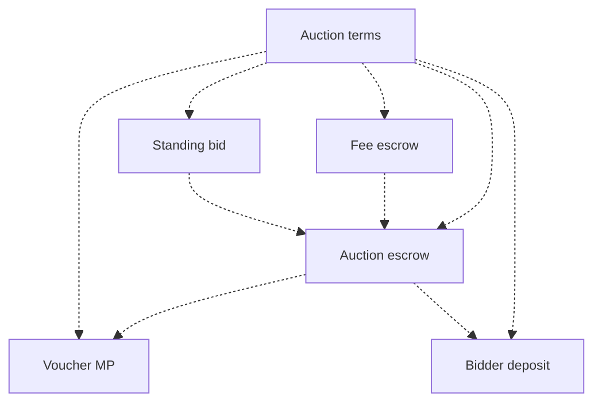

The validator scripts do not need to depend
on the voucher minting policy at compile time,
because their datums mention the voucher’s currency symbol.

### Parameters and state

An auction is uniquely parametrized by its **auction terms**,
which are fixed when it is announced.

```haskell
data AuctionTerms = AuctionTerms
  { auctionLot :: AssetClass
  -- ^ What is being sold at the auction?
  , seller :: PubKeyHash
  -- ^ Who is selling it?
  , hydraHeadId :: CurrencySymbol
  -- ^ Which Hydra Head is authorized to host the bidding for this auction?
  , delegates :: [PubKeyHash]
  -- ^ Who is running the authorized Hydra Head?
  , biddingStart :: POSIXTime
  -- ^ When can bidding start?
  , biddingEnd :: POSIXTime
  -- ^ When must bidding end?
  , voucherExpiry :: POSIXTime
  -- ^ After which time can the winning bidder
  -- no longer be able to buy the auction lot?
  , cleanup :: POSIXTime
  -- ^ After which time can the remaining auction utxos be cleaned up?
  , auctionFeePerDelegate :: Natural
  -- ^ Each delegate will receive this fee portion from the proceeds of
  -- the auction, when the auction lot is purchased or reclaimed.
  , startingBid :: Natural
  -- ^ The auction lot cannot be sold for less than this bid price.
  , minimumBidIncrement :: Natural
  -- ^ A new bid can only supersede the standing bid if it is larger
  -- by this increment.
  , utxoNonce :: UtxoRef
  -- ^ The seller consumed this utxo input in the auction announcement
  -- transaction that provided the auction lot to the auction.
  }
```

The `utxoNonce` in the auction terms ensures
that the voucher’s currency symbol is unique
because the voucher minting policy
is statically parametrized by the auction terms.
Similarly, all the validator scripts in the auction are made unique
via static parametrization on the auction terms.

Between the auction announcement and the bidding start time,
the seller fixes the list of bidders
who are approved to submit bids in the auction.
The seller also computes a hash of the list of approved bidders.

```haskell
data ApprovedBidders = ApprovedBidders
  { bidders :: [PubKeyHash]
  -- ^ Which bidders are approved to submit bids?
  }

data ApprovedBiddersHash = ApprovedBiddersHash SomeHash
-- ^ This hash is calculated from the `ApprovedBidders` value that the seller
-- fixes for the auction.
```

At bidding start time, the seller initializes the standing bid state with
the list of approved bidders and an empty standing bid.
The list of approved bidders must stay immutable afterward,
but the standing bid can be modified
as new bids are submitted to the auction until the bidding end time.

```haskell
data StandingBidState = StandingBidState
  { approvedBidders :: ApprovedBidders
  , standingBid :: Maybe BidTerms
  }

data BidTerms = BidTerms
  { bidder :: PubKeyHash
  -- ^ Who submitted the bid?
  , bidPrice :: Natural
  -- ^ Which price did the bidder set to buy the auction lot?
  }
```

If the auction is moved to the Hydra Head defined in the auction terms,
then the standing bid state must be available on that L2 ledger,
to allow the standing bid to be replaced
by new bids submitted to the Hydra Head.

On L1, the state of the auction is tracked in two phases:

```haskell
data AuctionState =
    Announced
  | BiddingStarted ApprovedBiddersHash
```

When the seller fixes the list of approved bidders,
the corresponding hash is fixed in the L1 auction state,
to allow the detection of any tampering with the list on L2.

### Script datums

The auction terms track the immutable information known at auction announcement,
while the script datums track information that is either
unknown at that time or can change afterwards.
The script datums also track the voucher's currency symbol
because parametrizing the validator scripts on it
would result in a circular dependency.

```haskell
data AuctionEscrowDatum = AuctionEscrowDatum
  { auctionState :: AuctionState
  , voucherCS :: CurrencySymbol
  }

data StandingBidDatum = StandingBidDatum
  { standingBid :: StandingBidState
  , voucherCS :: CurrencySymbol
  }

data BidDepositDatum = BidDepositDatum
  { bidder :: PubKeyHash
  -- ^ Which bidder made this deposit?
  , voucherCS :: CurrencySymbol
  }

type AuctionFeeEscrowDatum = ()
```

### Voucher minting policy

The voucher token is an NFT
that acts as the state token for the standing bid of the auction.
The true standing bid utxo for the auction at any given time
is the one that contains the voucher,
which proves its provenance from the auction announcement transaction
that sets the auction terms.
Any standing bid utxo that does not contain the voucher token
must be rejected as a false standing bid.

The voucher minting policy is responsible for
the proper execution of the auction announcement transaction.
The voucher is minted when the auction is announced,
and it is burned after the cleanup time for the auction.

The **auction announcement** is the transaction
that mints the voucher for a given auction.
It is the starting point in the lifecycle of every auction.

Under the **mint voucher** redeemer, we enforce that:

- There is one input spent by the seller that contains the auction lot.
This input's `UtxoRef` is the same as
the `utxoNonce` defined in the auction terms.
- This is one voucher NFT minted,
with this minting policy’s own currency symbol.
- There is one output sent to the auction escrow validator,
containing the minted tokens and the auction lot.
The auction escrow datum is initialized using `initAuctionEscrowDatum`
with the auction’s voucher currency symbol.
- The conditions in `validAuctionTerms` are satisfied
when applied to the auction terms.
- The transaction validity interval ends before the bidding start time.

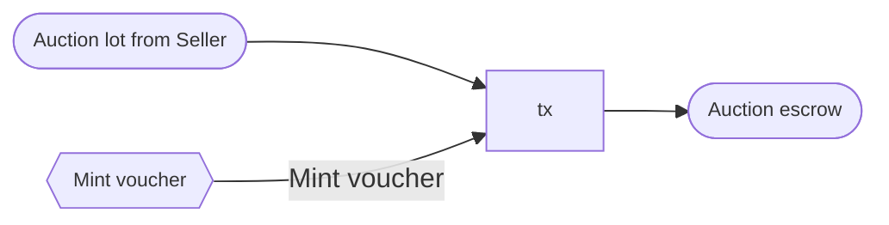

The initial datum for the auction escrow must be set as follows:

```haskell
initAuctionEscrowDatum :: CurrencySymbol -> AuctionEscrowDatum
initAuctionEscrowDatum voucherCS = AuctionEscrowDatum
  { auctionState = Announced
  , voucherCS = voucherCS
  }
```

The auction terms must satisfy the following conditions:

```haskell
validAuctionTerms :: AuctionTerms -> Bool
validAuctionTerms AuctionTerms{..} =
  biddingStart < biddingEnd &&
  -- bidding ends after it starts
  biddingEnd < voucherExpiry &&
  -- voucher expires after bidding ends, so that the winning bidder
  -- can buy the auction lot.
  voucherExpiry < cleanup &&
  -- cleanup happens after voucher expiry, so that the seller can claim
  -- the winning bidder's deposit if the auction lot is not sold
  minimumBidIncrement > 0 &&
  -- new bids must be larger than the standing bid
  auctionFeePerDelegate > 2_000_000 &&
  -- the auction fee for each delegate must contain the min 2 ADA for the utxos
  -- that will be sent to the delegates during fee distribution.
  startingBid > auctionFeePerDelegate * length delegates &&
  -- the auction fees for all delegates must be covered by the starting bid
  length delegates > 0 &&
  -- there must be at least one delegate
```

The seller must ensure that the `delegates` defined in the auction terms
are the same as the Hydra Head participants in the `hydraHeadId` Hydra Head.
Otherwise, the Hydra Head participants may refuse to host the auction bidding
because the auction fees would not go to the Hydra Head participants.
Unfortunately, this correspondence between delegates and Hydra Head participants
cannot be verified by on-chain logic in the auction announcement transaction.

Under the **burn voucher** redeemer, we enforce that:

- The transaction validity range starts after the cleanup time.

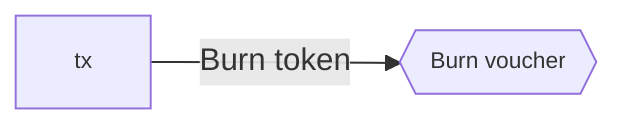

### Auction escrow validator

This validator holds the auction lot after the auction announcement,
until either the winning bidder buys it or the seller reclaims it.

Under the **start bidding** redeemer, we enforce that:

- There is one input spent from the auction escrow validator,
containing the auction lot and voucher tokens defined in the auction terms.
The auction state is `Announced` in its datum.
- There is one output sent to the auction escrow validator,
containing the auction lot.
The datum of the auction escrow must be modified using
`startBiddingAuctionEscrowDatum` with the hash of the list of approved bidders.
- There is one output sent to the standing bid validator,
containing the voucher.
The standing bid datum is initialized using `initStandingBidDatum` with
the auction’s voucher currency symbol and the list of approved bidders.
- The transaction validity interval starts after the bidding start time
and ends before the bidding end time.
- The transaction is signed by the seller.
- No tokens are minted or burned.

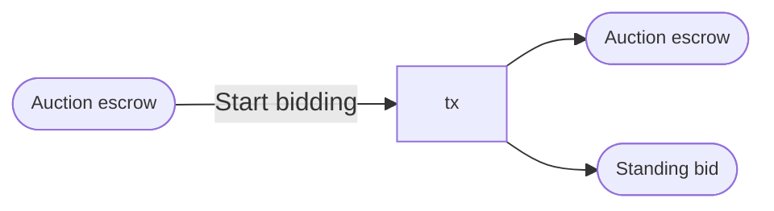

The auction escrow datum must be set as follows
under the `start bidding` redeemer:

```haskell
startBiddingAuctionEscrowDatum
  :: ApprovedBiddersHash
  -> AuctionEscrowDatum
  -> AuctionEscrowDatum
startBiddingAuctionEscrowDatum approvedBiddersHash auctionEscrowDatum =
  auctionEscrowDatum{auctionState = BiddingStarted approvedBiddersHash}
```

The initial datum for the standing bid utxo must be set as follows:

```haskell
initStandingBidDatum :: CurrencySymbol -> ApprovedBidders -> StandingBidDatum
initStandingBidDatum voucherCS approvedBidders = StandingBidDatum
  { standingBid = StandingBidState
      { approvedBidders = approvedBidders
      , standingBid = Nothing
      }
  , voucherCS = voucherCS
  }
```

Seller cannot be one of approved bidders.

Under the **seller reclaims** redeemer, we enforce that:

- There is one input spent from the auction escrow validator.
- There is one output sent to the seller,
containing the auction lot.
- There is one output sent to the fee escrow validator,
containing the total auction fees that will be distributed to the delegates.
- The transaction validity interval starts after the voucher expiry time.
- No tokens are minted or burned.

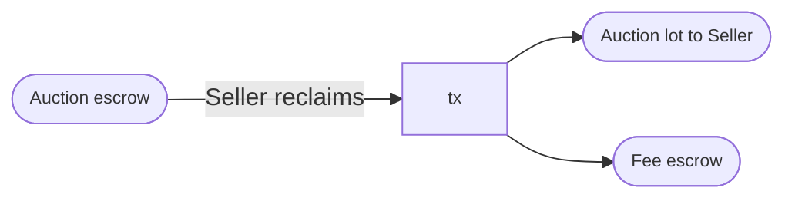

Under the **bidder buys** redeemer, we enforce that:

- There is one input spent from the auction escrow validator,
containing the auction lot mentioned in the auction terms.
Its datum defines the auction state and voucher currency symbol.
- There is one reference input from the standing bid validator,
containing the voucher mentioned in the auction escrow datum
and defining the standing bid state.
- There is one output sent to a buyer, containing the auction lot.
- There is one output sent to the seller,
containing the standing bid amount minus the total auction fees,
plus the ADA amount contained in the auction escrow and standing bid utxos.
- There is one output sent to the fee escrow validator,
containing the total auction fees that will be distributed to the delegate.
- The conditions in `validBuyer` are satisfied when applied to
the auction terms, auction state, standing bid state, and buyer.
- The transaction validity interval starts after the bidding end time
and ends before the voucher expiry time.
- No tokens are minted or burned.

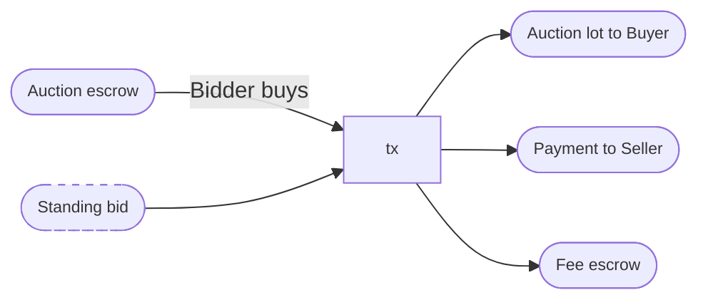

The standing bid datum is valid for the bidder to buy the auction lot
if the following conditions are met under the auction terms:

```haskell
validBuyer
  :: AuctionTerms
  -> AuctionState
  -> StandingBidState
  -> PubKeyHash
  -> Bool
validBuyer AuctionTerms{..} aState StandingBidState{..} buyer
  | BiddingStarted approvedBiddersHash <- aState
  , Just BidTerms{..} <- standingBid =
  buyer == bidder &&
  -- ^ The buyer is the bidder who submitted the standing bid
  bidder `elem` approvedBidders &&
  -- ^ The bidder that submitted the standing bid is one of the approved bidders
  approvedBiddersHash == hash(approvedBidders) &&
  -- ^ The list of approved bidders has not been changed since bidding started
validStandingBidState _ _ _ _ = False
```

### Standing bid validator

The standing bid validator is primarily responsible for
the transitions in the standing bid state
that are allowed between the bidding start and end times.
It is also responsible for ensuring that the standing bid state exists
as long as it is needed by the other scripts
to determine who can claim the auction lot and bidder deposits.

Under the **move to hydra** redeemer, we enforce that:

- There is one input from the standing bid validator.
- There is one input from the Hydra Head initial validator
($\nu_\textrm{initial}$),
containing one Hydra Head participation token
of the same currency symbol as the `hydraHeadId` in the auction terms.
The redeemer provided to this input
mentions the standing bid input by `UtxoRef`.
- There is one output sent to the Hydra Head commit validator
($\nu_\textrm{commit}$),
containing the Hydra Head participation token.
- No tokens are minted or burned.

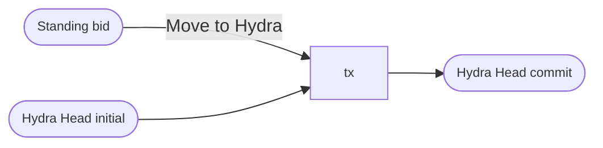

Under the **new bid** redeemer, we enforce that:

- There is one input from the standing bid validator,
defining the old standing bid state.
- There is one output sent to the standing bid validator,
defining the new standing bid state.
- The conditions in `validNewBid` are satisfied when applied to the auction terms,
old standing bid state,
and new standing bid state.
- The transaction validity range must end at the bidding end time.
- No tokens are minted or burned.

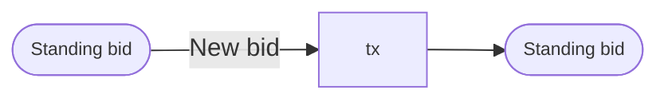

A new bid is allowed to change the standing bid state as follows:

```haskell
validNewBid
  :: AuctionTerms
  -> StandingBidState
  -> StandingBidState
  -> Bool
validNewBid AuctionTerms{..} oldStandingBidState newStandingBidState =
  isJust $ do
    let StandingBidState oldApprovedBidders oldBid = oldStandingBidState
    let StandingBidState newApprovedBidders newBid = newStandingBidState
    BidTerms bidder newPrice <- newBid
    -- The new bid was submitted by one of the approved bidders.
    guard $ bidder `elem` oldApprovedBidders
    -- The new bid respects the starting price and minimum bid increment
    -- conditions in the auction terms.
    guard $ case oldBid of
      Nothing ->
        startingPrice <= newPrice
      Just (BidTerms _ oldPrice) ->
        oldPrice + minimumBidIncrement <= newPrice
    -- The new standing bid state maintains the same list of approved bidders.
    guard $ oldApprovedBidders == newApprovedBidders
```

Under the **cleanup** redeemer, we enforce that:

- There is one input from the standing bid validator.
- The voucher in the input is burned.
  - Note: the minting policy enforces
  that this will only happen after cleanup time for the auction,
  and this token burn can only happen on L1.
- There is one output that pays
the remaining ADA from the standing bid utxo to the seller.

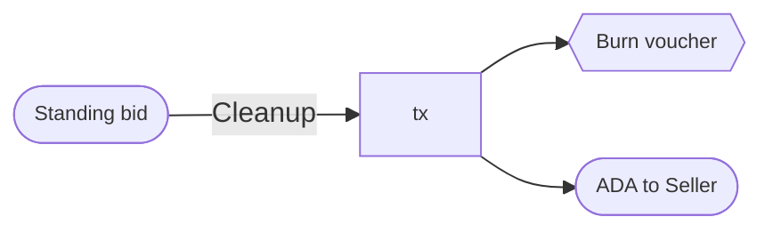

### Bid deposit validator

The bid deposit is responsible for ensuring
that bidders can recover their bid deposits,
except for the case when the seller claims the winning bidder’s security deposit
after the voucher expiry time.

If a bidder wishes to be considered by the seller for
participation in the auction as an approved bidder,
the bidder can send a utxo to the bid deposit validator,
mentioning the auction’s voucher currency symbol
and the bidder’s pub-key hash in the datum.

The seller has full discretion on whether
to include any bidder in the list of approved bidders for the auction,
but the seller should consider including bidders
that have provided bid deposits with enough ADA to satisfy the seller.
For the sake of fairness, the seller should
inform prospective bidders in the auction announcement
how much ADA they should deposit to qualify for the auction.
However, none of this is enforced by any of the auction’s on-chain validators.

Under the **losing bidder** redeemer, we enforce that:

- There is one input spent from the bid deposit validator,
defining the bidder and voucher.
- There is one reference input from the standing bid validator,
containing the voucher and defining the standing bid state.
- There is one output sent to the bidder,
containing the bid deposit.
- The standing bid state does not mention the bidder from the bid deposit.
- The transaction validity interval starts after the bidding end time.
- No tokens are minted or burned.

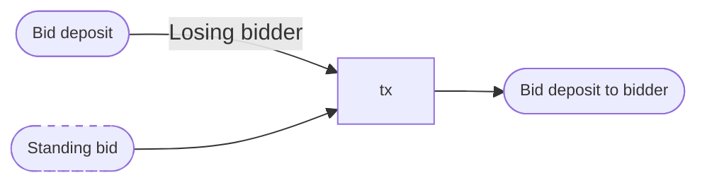

Under the **winning bidder** redeemer, we enforce that:

- There is one input spent from the bid deposit validator,
defining the bidder and voucher.
- There is one input spent from the auction escrow validator,
mentioning the same voucher as the bid deposit in its datum.
- The transaction is signed by the bidder.
- No tokens are minted or burned.

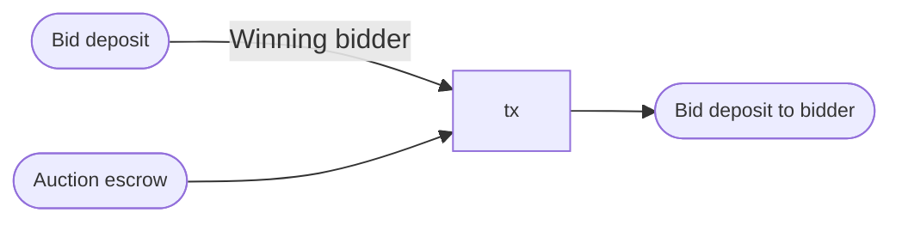

Under the **seller claims deposit** redeemer, we enforce that:

- There is one input spent from the bid deposit validator,
defining the bidder and voucher.
- There is one reference input from the auction escrow validator,
mentioning the same voucher and defining the seller and voucher expiry time.
- There is one reference input from the standing bid validator,
mentioning the same voucher and bidder as the bid deposit input.
- The transaction validity interval starts after the voucher expiry time.
- The transaction is signed by the seller.
- No tokens are minted or burned.

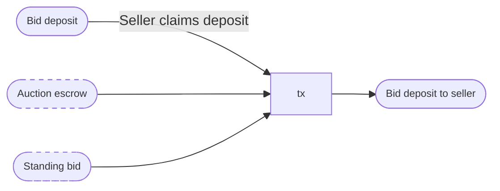

Under the **cleanup** redeemer, we enforce that:

- There is one input spent from the bid deposit validator,
defining the bidder and voucher.
- There is one output sent to the bidder containing the bid deposit.
- The transaction validity time starts after the cleanup time.
- No tokens are minted or burned.

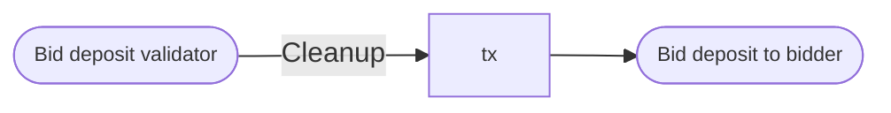

### Fee escrow validator

This validator is responsible distributing the total auction fees
evenly to the delegates, after deducting the transaction fee.

Under the **distribute fees** redeemer, we enforce that:

- There is one input spent from the fee escrow validator,
defining the delegates.
- There is one output per delegate.
The conditions in `validFeeDistribution` are satisfied
when applied to these outputs and the transaction fee.
- No tokens are minted or burned.

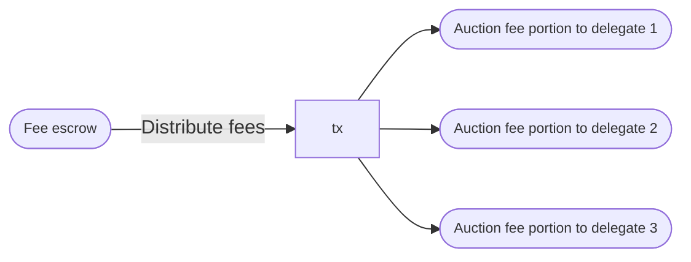

The fee distribution to delegates must satisfy the following conditions:

```haskell
validFeeDistribution :: AuctionTerms -> [TxOut] -> Value -> Bool
validFeeDistribution AuctionTerms{..} outputsToDelegates txFee =
    allAdaDistributed
      && adaDistributedEvenly
  where
    -- Each delegate received the `auctionFeePerDelegate`,
    -- after deducting the transaction fees from the total.
    allAdaDistributed = actualTotalAda == expectedTotalAda
    actualTotalAda = sum actualAdaValues + adaValueOf txFee
    expectedTotalAda = length delegates * auctionFeePerDelegate

    -- The amount received by any delegate differs by at most one lovelace
    -- from what any other delegate received.
    adaDistributedEvenly = 1 > maximum actualAdaValues - minimum actualAdaValues

    adaValueOf = valueOf adaSymbol adaToken
    actualAdaValues = adaValueOf . txOutValue <$> outputsToDelegates
```

To keep things simple in this design, we require
the number of delegates in an auction to be small enough
that distributing their respective portions of the auction fee
can be done in a single transaction.
Later on, this can be generalized in a straightforward way
to accommodate incremental fee distribution to a larger number of delegates.

## Architecture

We will be using a basic architecture in this project, consisting of:

- A single block producing Cardano Node.
- For each Hydra Head delegate:
  - A Hydra Node that communicates with the Cardano Node.
  - A CLI-based application that communicates
  with the Hydra Node through an API.
  - An API for the delegate to receive requests from the seller and bidders.
- For the seller and each bidder:
  - A CLI-based application to build and submit transactions to L1
  and to send requests to L2 delegates.

We will use PlutusTx to write the on-chain scripts
and `cardano-api` to write the off-chain transaction building code.

## API endpoints

### Delegate API for bidders

## The current state of Hydra and our design mitigations

### Ensuring that snapshots are closable

The current Hydra Head implementation does not support
minting and burning tokens in the fanout transaction,
and there is a limit to the number of utxos
that can be produced by the fanout transaction.
This means that it is impossible to close a Hydra Head
if its ledger contains newly minted or burned tokens,
or if it contains more utxos than can be supported by the fanout transaction.
The Hydra team is planning to address these limitations
by excluding “phantom tokens” (minted/burned on L2) from Hydra Head snapshots
([Hydra Issue #358](https://github.com/input-output-hk/hydra/issues/358))
and by only signing snapshots that are known to be closable
([Hydra Issue #370](https://github.com/input-output-hk/hydra/issues/370)).

These limitations do not affect the Hydra-based auction
because we do not mint or burn any tokens within the Hydra Head
and we only commit and fan out one utxo to/from the Hydra Head.

### Handling time on L2

The Cardano mainnet (L1) ledger keeps track of time
via slot numbers associated with each block in the chain,
and the duration between consecutive slot numbers is one second.
Each transaction can set a validity range of POSIX times
(converted internally to slots)
within which it can be added to a block,
and on-chain scripts can inspect this transaction validity range
to determine whether the transaction is valid
relative to time-dependent application logic.

The current Hydra Head (L2) implementation
keeps the slot number fixed at zero through all of its ledger state transitions.
The Hydra team plans to add support for time-constrained transactions,
but the specific design for this feature is still being developed.
The current proposal
([Hydra Issue #196](https://github.com/input-output-hk/hydra/issues/196))
is to periodically synchronize the slot number
(or corresponding POSIX time) from L1 to L2.
A more granular resolution for time is out-of-scope
for this feature (to be considered/added later).

In the Hydra-based auction, we really only need
to keep track of time within the Hydra Head
to determine when bidding can start and when it should end.
Bidding itself does not strictly require
tracking time explicitly within the Hydra Head:

- A new bid will replace the standing bid
that exists at the time that the new bid is validated
if the new bid exceeds the standing bid by the minimum bid increment.
- Simultaneous new bids will be resolved via utxo contention,
whereby the first bid among them to exceed the standing bid
and be multi-signed by the Hydra Head delegates
will replace the standing bid.

<aside>
💡 Simultaneous bids should occur less frequently on a Hydra Head because,
in principle, it should take much less time for the Head Head delegates
to achieve consensus on a ledger state transition
than it takes to achieve consensus on L1.
In other words, time resolution can effectively be much more granular
within a Hydra Head than on L1.

</aside>

For bidding start/end times, the only option is
to introduce explicit time dependence into the auction protocol.
The bidding start time can be enforced in a straightforward way,
by locking the voucher NFT on L1 in a script
that only allows it to be committed to the Hydra Head
on or after the bidding start time.

Enforcing the bidding end time strictly would require
time to be explicitly tracked within L2
and for at least one Hydra Head delegate to reject bid transactions
that exceed this bidding deadline.
This isn’t feasible with the current Hydra Head protocol implementation,
which keeps the slot number fixed at zero.
However, we can work around this limitation
by combining the following three techniques:

1. Require all bid transactions to set a transaction validity interval
that starts at slot 0 and ends at the bidding end time.
This is enforced by the standing bid script
that determines whether a new bid can replace the standing bid.
2. Use the Hydra Head closing and contestation mechanisms
to force the auction towards L1 near the bidding end time.
3. Once the bidding end time elapses, allow the standing bid utxo
(which contains the voucher NFT)
to be spent by its bidder (i.e. the winning bidder)
to buy the auction lot from the seller.

The first technique does not affect the validity of transactions
within the Hydra Head (where the slot is always zero),
but it prevents further bids from being accepted
once the bidding end time elapses and the Hydra Head is fanned out.

In the second technique,
we use the Hydra Head closing and contestation mechanisms as follows
to force the auction toward L1 near the bidding end time:

- When a bidder submits a bid to a Hydra Head delegate,
via the delegate’s bid submission API,
the delegate will broadcast the bid transaction to the other delegates
and collect the multi-signature from them according to the Hydra Head protocol.
- When the multi-signature is obtained for the bid transaction,
the delegate responds to the bidder that the bid was accepted.
- In this response to the bidder,
the delegate attaches a transaction (signed by the delegate)
that would close the Hydra Head
with the ledger state achieved by the bid transaction.
- The validity range for this closing transaction
is set to start at the bidding end time, minus the contestation period duration.
If this closing transaction is submitted by the bidder to L1
as soon as its validity range begins,
then the contestation period for the Hydra Head closure
should conclude near the bidding end time.

Providing a signed closing transaction to the bidder at bid confirmation
results in a high probability
that the auction will move to L1 near the bidding end time
because the winning bidder has a very strong incentive
to end bidding in the Hydra Head as soon as he is allowed to do so.
Furthermore, the closing transaction does not need any further signatures
(from the bidder or anyone else),
which means that the bidder’s application frontend can submit it automatically
when it’s time.
The closing transaction can also be broadcast to the seller and other bidders,
in order to further improve the probability that the auction moves to L1
at the bidding end time.

The third technique ensures that the auction is resolved
as soon as the auction moves back to L1 and the bidding end time elapses,
without requiring any additional transactions from the Hydra Head delegates.
At that point, nothing blocks the winning bidder from buying the auction lot.

If the Hydra team adds support for timed transactions on L2,
then delegates would be able to enforce the bidding end time
directly in the Hydra Head ledger rules.
However, the delegates can already enforce this after the bidding end time
by rejecting bid submission API requests from bidders,
refusing to sign bid transactions from delegates,
and closing the Hydra Head.
Indeed, they should do these things regardless of whether
the bidding end time is validated by Hydra Head ledger rules.

The second technique still remains useful
even if timed transactions are supported on L2
because it allows bidders to close the Hydra Head near the bidding end time,
even if none of the delegates do it —
though we’re still relying on the delegates to contest the closing if needed
to ensure that the latest standing bid is fanned out.
Therefore, support for timed transactions on L2
would not particularly affect the auction design.

<aside>
💡 Note that the second technique does slightly degrade
the security properties of the Hydra Head protocol relative to the baseline.
If a bidder submits a closing transaction signed by a particular delegate,
then that delegate cannot submit a contestation transaction
and we must rely on the other delegates
to submit contestation transactions with the latest standing bid.
The original security properties would be recovered
if the Hydra Head participant that submitted a closing transaction
were also allowed to submit a contestation transaction.

</aside>

### Open vs closed auctions

In this project, we implement a closed auction,
where the seller controls which bidders
can enter the auction before bidding starts.
This auction type is appropriate where the seller needs
to verify the list of bidders before allowing them to enter the auction,
and most auction platforms need to be able to support this type of auction.

The other type of auction is an open auction,
where bidders can freely enter the auction and place bids.

[Why are we doing a closed auction — security deposits]

[How could the implementation be extended to open auctions — …]
