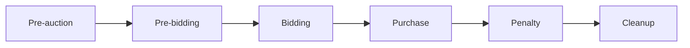
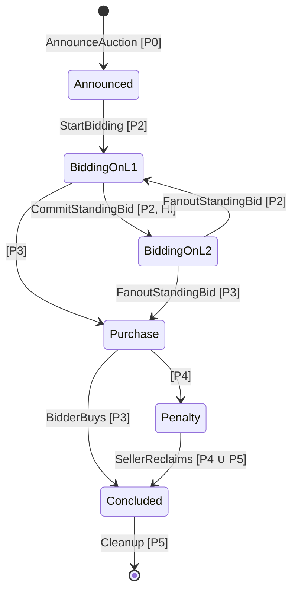
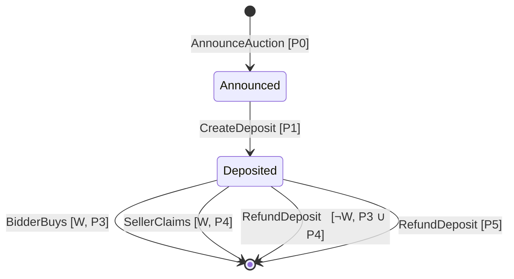
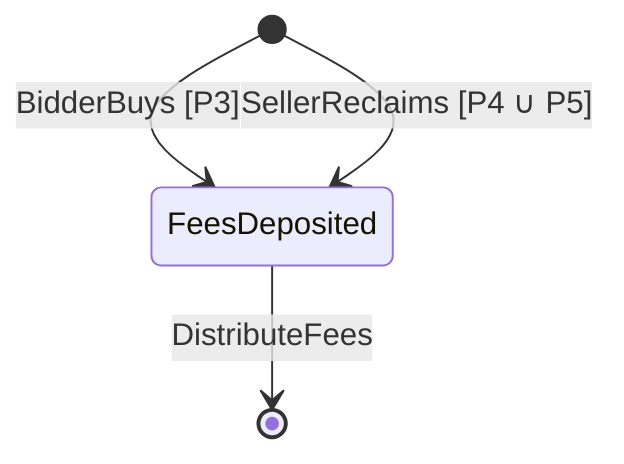

# Domain Logic
In this document, we describe the terminology and models
that we use in the Hydra Auction project.

## Cardano terminology

In this document, we use L1 and L2 as follows:

<table><tr><td>

**Layer 1 (L1):** the Cardano main network (mainnet) and ledger.

</td></tr><tr></tr><tr><td>

**Layer 2 (L2):** the network and ledger within a single Hydra Head.

</td></tr></table>

## Auction terminology

**Assets:**

<table><tr><td>

**Auction lot:** the NFT asset being sold in the auction.

</td></tr></table>

**Bidding:**

<table><tr><td>

**Minimum bid increment:** a new bid can replace the standing bid
only if it exceeds it by at least this minimum increment.

</td></tr><tr></tr><tr><td>

**Starting bid:** the smallest bid that can be accepted by the auction.

</td></tr><tr></tr><tr><td>

**Standing bid:** the highest of the bids
that have been submitted on or before a given time.

</td></tr></table>

**Deposits:**

<table><tr><td>

**Bidder deposit:** a fixed deposit that each bidder must provide
(i.e. lock into the auction’s bidder deposit smart contract)
to be eligible to participate in the auction.
A bidder’s deposit can be claimed by the seller
if the bidder wins the auction
but does not buy the auction lot by the purchase deadline time.

</td></tr></table>

**Fees:**

<table><tr><td>

**Auction fees**: fees paid to the delegates as compensation for
hosting the bidding process of the auction on L2.
These fees must be paid when the winning bidder buys
or the seller reclaims the auction lot,
and they must be distributed equally to the delegates.
If the winning bidder buys the auction lot,
then the auction fees are deducted from his payment to the seller.

</td></tr></table>

**Roles:**

<table><tr><td>

**Bidders:** a group of people seeking to place bids to buy the auction lot.

</td></tr><tr></tr><tr><td>

**Delegates:** a group of people trusted to collectively witness new bids
and track the standing bid over time.

</td></tr><tr></tr><tr><td>

**Seller:** the person seeking to sell the auction lot.

</td></tr><tr></tr><tr><td>

**Winning bidder:** the bidder whose bid is the standing bid
at the bidding end time for the auction.

</td></tr></table>

## Auction lifecycle

The auction lifecycle is defined by the following times,
declared by the seller when the auction is announced:

<table><tr><td>

`T0` Auction announcement time

</td></tr><tr></tr><tr><td>

`T1` Bidding start time

</td></tr><tr></tr><tr><td>

`T2` Bidding end time

</td></tr><tr></tr><tr><td>

`T3` Purchase deadline time

</td></tr><tr></tr><tr><td>

`T4` Cleanup time

</td></tr></table>

For the purposes of modeling the state transitions of the auction,
we partition time into periods () by the above lifecycle times:

<table><tr><td>

`P0 = [0,  T0)` Pre-auction period

</td></tr><tr></tr><tr><td>

`P1 = [T0, T1)` Pre-bidding period

</td></tr><tr></tr><tr><td>

`P2 = [T1, T2)` Bidding period

</td></tr><tr></tr><tr><td>

`P3 = [T2, T3)` Purchase period

</td></tr><tr></tr><tr><td>

`P4 = [T3, T4)` Penalty period

</td></tr><tr></tr><tr><td>

`P5 = [T4,  ∞)` Cleanup period

</td></tr></table>

## Auction state machine

An auction can be modelled by the following state machine.
Here we use the UML statechart formalism,
whereby each transition is labelled as
`input [condition]`.
A conjunction of multiple conditions is labelled
as `[condition1, condition2, ...]`.
We omit the outputs of each state transition.

The state transitions are as follows:

<table><tr><td>

`AnnounceAuction [P0]`. Before the auction announcement time `T0`,
the seller can announce the auction via an L1 blockchain transaction
that locks the auction lot into the auction escrow
and specifies the terms of the auction.

</td></tr><tr></tr><tr><td>

`StartBidding [P2]`. During the bidding period
(preferrably at the bidding start `T1`),
the seller can declare the list of approved bidders for the auction
and initialize the standing bid for the auction,
which allows these bidders to start placing bids in the auction
via L1 transactions.

</td></tr><tr></tr><tr><td>

`CommitStandingBid [P2, HI]`. During the bidding period,
if the Hydra Head that will host the auction is still initializing (`HI`),
then the standing bid can be moved to the Hydra Head,
allowing bidders to place bids in the auction via L2 transactions
(but no longer via L1).

</td></tr><tr></tr><tr><td>

`FanoutStandingBid [P2]`. During the bidding period,
the standing bid can be moved back to L1
via fanout from the Hydra Head,
allowing bidders to place bids in the auction via L1 transactions
(but no longer via L2).
This transition is undesirable because
bidding on L1 is less convenient than on L2.

</td></tr><tr></tr><tr><td>

`[P3]`. During the purchase period,
bidders can no longer submit any new bids
(neither via L1 nor L2).

</td></tr><tr></tr><tr><td>

`FanoutStandingBid [P3]`. During the purchase period
(preferrably at the bidding end time `T2`),
the standing bid can be moved back to L1
via fanout from the Hydra Head,
after which bidders can no longer submit any new bids
(neither via L1 nor L2).

</td></tr><tr></tr><tr><td>

`BidderBuys [P3]`. During the purchase period,
the bidder can buy the auction lot,
paying the winning bid amount to the seller
and depositing the total auction fees in the fee escrow.

</td></tr><tr></tr><tr><td>

`[P4]`. During the penalty period,
the winning bidder can no longer buy the auction lot.

</td></tr><tr></tr><tr><td>

`SellerReclaims [P4 ∪ P5]`. During the penalty period
and during the cleanup period,
if the winning bidder (if any) did not buy the auction lot,
then the seller may reclaim the auction lot,
depositing the total auction fees in the fee escrow.

</td></tr><tr></tr><tr><td>

`Cleanup [P5]`. During the cleanup period,
the seller can spend the standing bid utxo,
recovering the min 2 ADA inside it.

</td></tr></table>

## Bidder deposit state machine
We use a separate state machine to represent a bidder deposit,
because the auction does not interact with bidder deposits directly.
Instead, the state of the auction can be referenced
to enable certain state transitions
in the bidder deposit state machine.

Conversely, while the seller may observe
which bidders have created deposits for the auction
to decide on the list of approved bidders at bidding start,
this is not enforced by on-chain code
so we represent this as an arbitrary decision
by the seller in the auction state machine.

The state transitions are as follows:

<table><tr><td>

`AnnounceAuction [P0]`. Bidder deposits should not be created
before the auction is announced.

</td></tr><tr></tr><tr><td>

`CreateDeposit [P1]`. During the pre-bidding period,
a bidder can create a deposit for an auction
in order to be considered by the seller of the auction
for inclusion in the auction's list of approved bidders.

</td></tr><tr></tr><tr><td>

`BidderBuys [W, P3]`. During the purchase period,
the bidder can claim the deposit (if available)
while buying the auction lot,
to use some of the ADA in the deposit
in the payment of the winning bid amount to the seller.

</td></tr><tr></tr><tr><td>

`SellerClaims [W, P4]`. During the penalty period,
the seller can claim the winning bidder's deposit (if available),
by referencing on-chain auction state that proves
that the winning bidder did not buy the auction lot.

</td></tr><tr></tr><tr><td>

`RefundDeposit [¬W, P3 ∪ P4]`. During the purchase period
and during the penalty period,
the bidder can reclaim his deposit (if available)
by referencing on-chain auction state that proves
that the bidder did not win the auction.

</td></tr><tr></tr><tr><td>

`RefundDeposit [P5]`. During the cleanup period,
the bidder can reclaim his deposit (if available)
unconditionally.

</td></tr></table>

## Fee escrow state machine

We use a separate state machine for the fee escrow because,
while it gets initialized during a state transition of the auction,
its further evolution proceeds independently from the auction.

The state transitions are as follows:

<table><tr><td>

`BidderBuys [P3]`. During the purchase period,
the total auction fees are deposited in the fee escrow
if the bidder buys the auction lot.

</td></tr><tr></tr><tr><td>

`SellerReclaims [P4 ∪ P5]`. During the penalty period
and during the cleanup period,
the total auction fees are deposited in the fee escrow
if the seller reclaims the auction lot.

</td></tr><tr></tr><tr><td>

`DistributeFees`. Once the total auction fees are deposited
into the fee escrow,
they can be distributed equally to the delegates
of the Hydra Head that hosted the auction on L2.

</td></tr></table>
